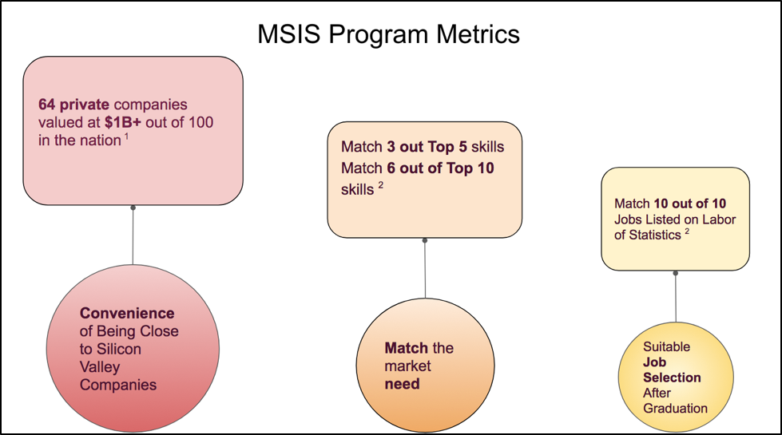
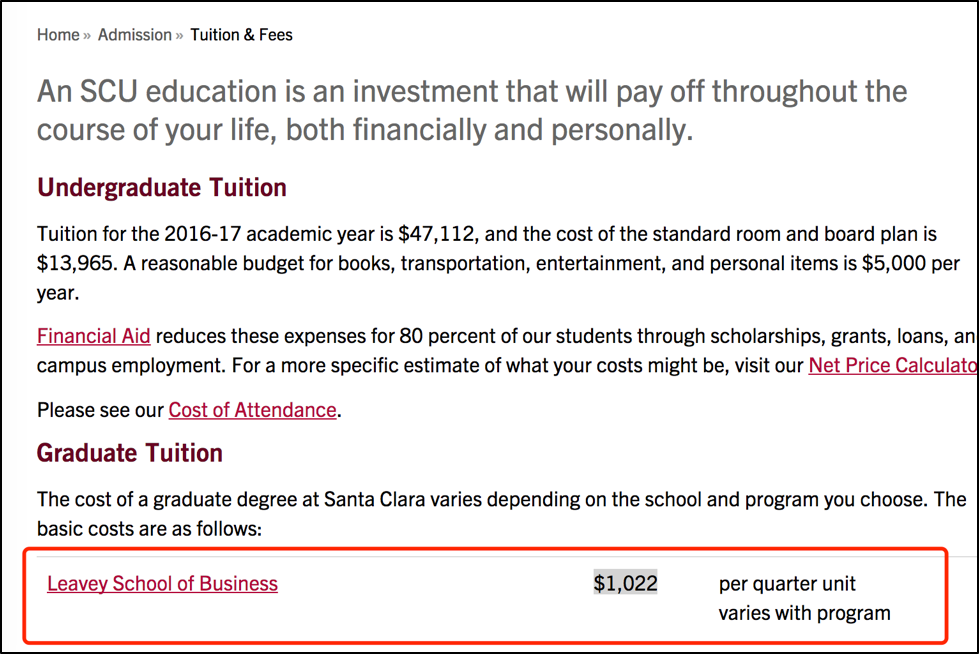
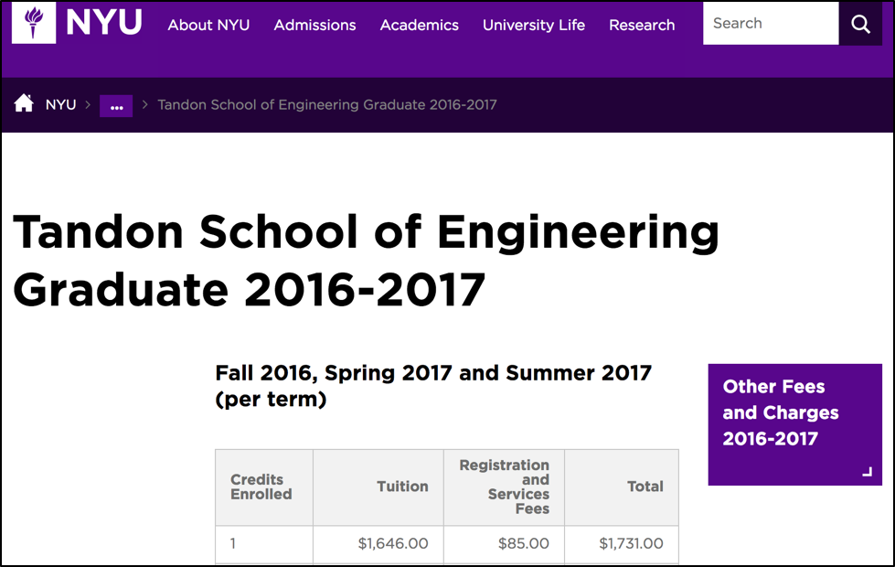
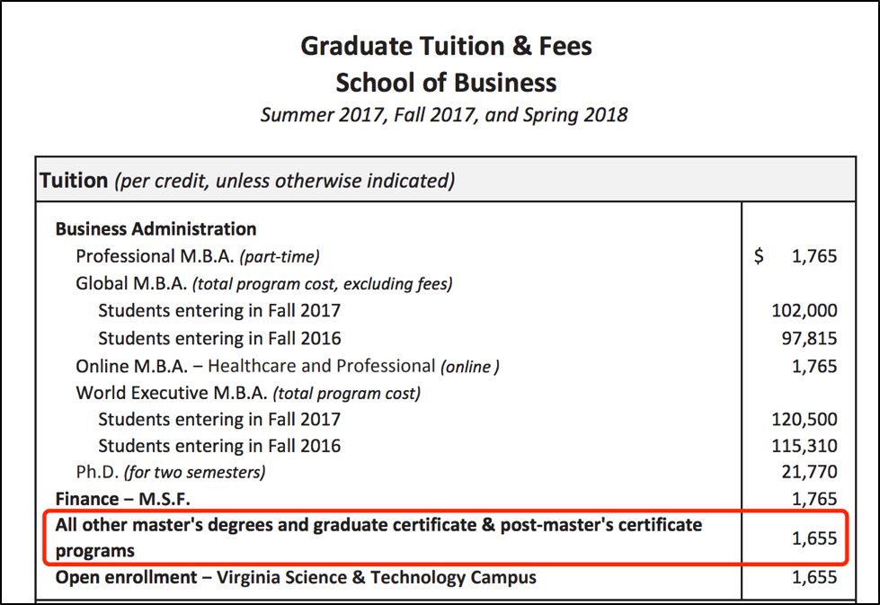

# Lab 9

[Link to Tableau Public](https://public.tableau.com/profile/meiyuan.li#!/vizhome/Book1_24039/Recruters)
 

## Critiques on my previous visualization  
**Lab 5 Visualization**

This visualization is really raw.

And the metrics are not used in a way to compare and contrast.

They just scattered on the page and only SCU MSIS data was shown.

## Roadmap for improvement

I want to integrate more than one metrics together to show that SCU MSIS has its advantages.

First and foremost,  MSIS program has the edge that only a few schools has, that is the countless job opportunities after graduation.

According to Wikipedia on Silicon Valley, 'The Bay Area as a whole however, of which Silicon Valley is a part, would rank first with 387,000 high-tech jobs.'

For the purpose to compare, I want to find out the second and third job availabilities area.

Also taken from the Wikipedia article on Silicon Valley, 'Silicon Valley was the third largest high-tech center (cybercity) in the United States, behind the New York metropolitan area and Washington metropolitan area.'

So I need to investiage the job options from these two areas. 

I found the original article "Cybercities 2008: An Overview of the High-Technology Industry in the Nation's Top 60 Cities" citing that the number for these two areas are 316,500 and 295,800 respectively.

Another metric I could think of is the tuition fee that students usually care about a lot. Since I alreay have the top three areas regarding job opportuniteis, I figure I should find out the schools in these two areas has MSIS program and see what their tuition are.

I wanted to compare the total tuition of three schools at first. But the two schools I picked out NYU and GWU don't have a clear instruction how many credits students should take to graduate. In addition, it may require different credits for different students. So to be fair, I use the tuition per credit metric.

After some searching, I got the price of NYU MSIS and GWU MSIST program per credit.

 
[**SCU MSIS Price per Credit**](https://www.scu.edu/admission/tuition--fees/)

[**NYU MSIS Price per Credit**](https://www.nyu.edu/students/student-information-and-resources/bills-payments-and-refunds/tuition-and-fee-rates/2016-2017/tandon-school-of-engineering-graduate-2016-2017.html)

[**GWU MSIST Price per Credit**](https://studentaccounts.gwu.edu/sites/studentaccounts.gwu.edu/files/downloads/FY18%201718%20GWSB%20RATES.pdf)

The rest is just to combine these two metrics together to see where SCU MSIS stands.

## Improved Visualization  

See the link at the beginning of this file

## How have I improved my visualization

I developed a scatter plot where the x axis is the tuition per credit and y axis is the available job opportunities. From this scatter plot, we can clearly see that SCU MSIS program has the best location in the country when it  comes to job opportunitis yet its tuition fee is not sky high like other 'cybercity'.