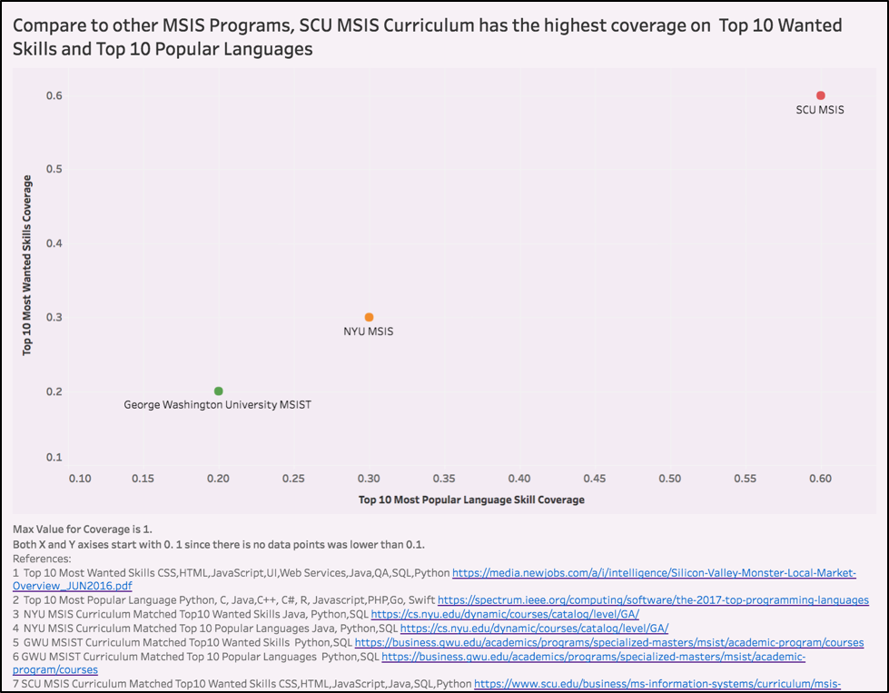

# Lab 9

[Link to Tableau Public](https://public.tableau.com/views/IntegratedVis/IntegratedDashboard?:embed=y&:display_count=yes&publish=yes)

## Critiques on my previous visualization  
**Lab 5 Visualization**

Only MSIS program's data is shown here. 
No comparsion to indicate whether 0.6 is high or low.

## Roadmap for improvement

Integrate two metrics together to develop a scatter plot.

Find more data point to comparsion.

If time permits, I would search on top 10 ranking MSIS' program's curriculum and compute their coverage. 

Also, I can compare with California MSIS program's coverage.

## Improved Visualization  

See the link at the beginning of this file

## How have I improved my visualization

For the time being, I only selected Lab 8's another two schools which has MSIS program. Going through their curriculum pages, only a few key words matched my previously developed metrics which are Top 10 Most Wanted Skills and Top 10 Most Popular Languages.

