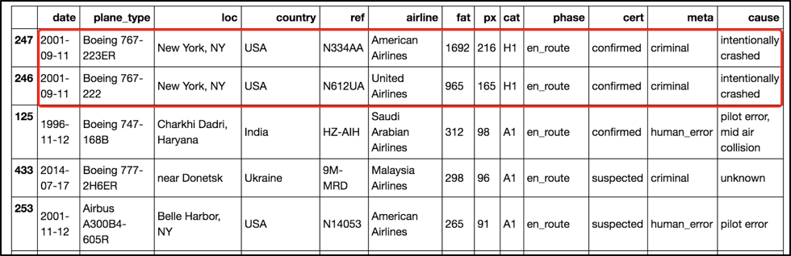

# Visulization Redesign 
[**Tableau Public Link** ](https://public.tableau.com/views/Book2_18545/FatData?:embed=y&:display_count=yes&publish=yes)  
[**Jupyter Notebook Link**](https://github.com/meiyuanli312/Dashboard/blob/master/Redesign/Redesign%20-%20Meiyuan%20Li.ipynb)

This README file contains the following project delieverables

1. [Project statement](#1)
2. ['Making-of' documentation](#2)
3. [Intermediate visualization prototypes] (#3)
4. [Final data visualization] (#4)
5. [Road map with future features] (#5)
6. [Showcase video] (#6)

## Project Statment 
### Motivation 
Plane crashes are horrible. But they happened again and again. It seems there is no improvement for us human when it comes to avoid plane crashes. Sometimes we know how it happened, sometimes we don’t.  I hope by looking at the data  we gathered, we can present some findings on plane crashes, which could guide us to the right direction for further action.

### Objective
There is this one visualization on 'Information Is beautiful' describing plane crashes.
It is a very detail display of information. The square represent the number of deaths in each incident. Bigger number indicates more lifies. When viewer hover the mouse to the square, related data will pop up including number of deaths, date, aircraft, location,air line,cause, etc. 

Audience can sort the incident by dates (latest and oldest) , casualty number(most and least), fly phase(grounded, takeoff,initial climb,en route, approaching,landing ) and cause(human error, weather, mechanical, criminal, unkown). 

But they still need to hover to see information after filtering.

I think it’s pretty amazing all information can be displayed on one screen. However, I found it require a lot of viewer interaction for the numbers and words to get through. If the audience don’t hover or click anything, they will just have to stare a lot of colorful squares. Moreover, it doesn’t tell us which phases crashes happened most and what the root cause of human error.

So the objective of my redesign will be displaying  the most important information on different pages  without any interaction so audience will know immediately the message I want to convey.

### Data

[Link to the original data on 'information is beautiful'](https://docs.google.com/spreadsheets/d/1OvDq4_BtbR6nSnnHnjD5hVC3HQ-ulZPGbo0RDGbzM3Q/edit#gid=1
)

### Project Plan

1. Throw data into Tableau first and see what draft chart it can give me 
1. Find out what information I need to search and clean to get the desired chart
1. Data Wrangling in Jupyter Notebook and save data
1. Load Saved data into Tableau and fine tuning in Tableau
1. Data Visualization

 
## 'Making-of' Document
First read the excel in and Inspect

Remove the first row (it caused a null in Tableau) and some other columns which we we won’t use at all

Inspect the semi-cleaned Data

Save this table first

This csv file will be used for visualization **1, 3, 4, 5 and 6.**

In order to extract the top 10 Fatalty 

Sort by  Fatalities Numbers first  and we can see Values in column ‘fat’  are string so we need to convert them to integer

Conversion and inspect the top 10

We can see the first two columns are 9/11 attacks related. 
I want to find out after ruling out ‘criminal’, which ‘meta cause’  accounts most?
(Leaving Row 3 in the list , which is also ‘criminal’ related, because the cause of this incident is not verified.)

Save this top 10 to csv file

This table will be used for **Visualization 2**

##  Intermediate Visualization Prototypes

### 1. Intermediate visualization for the first chart (overview of the numbers) 

I want to see the number of incidents each year to get the ‘big picture’. 

I thought bar chart will be the best representation of time series data, but I remembered we should always sort bar chart and sorting doesn’t make sense here because I want to show the data by year. So I changed to the bar chart to line chart. However I feel this indicates as time goes by, plane crashes varies.

So I tried area chart also. I think this remove the hidden ‘time trend’ meaning of the data.

Null data is filtered at this intermediate chart but it was later removed in Jupyter notebook  

Work left for the  final visualization:  

* 	Explain the spike

### 2. Intermediate visualization for the second chart (Top 10 Air Plane Crashes)

At first, I want to list all incidents on the map, but this doesn’t make much sense because Tableau will automatically aggregate data  based on country information we have.  Knowing which country has most number of accidents is meaningless. 

Then I thought maybe I can filter the top 10 incidents and drew them on the map.
(Tried at Tableau First but was no vail.)

I could just use the bar chart to display this information but I like the idea of map.
So using Jupyter Notebook to find the top 10 fatality number, their location and causes, then  save them as a new data set.
Reload the data set to Tableau.

Label information on these ten incidents.

Work left for final visualization:  

* 	Fine tune the map layer
* 	Adjust the circle to indicate the size of the number
* 	Format the label box 

### 3. Intermediate visualization for the third chart (Meta Cause Bar Chart)

Use meta cause and number of fatality to draw a single bar chart 

Work left for the final visualization:  

* 	Remove y axis header and x axis label.
* 	Point out human error are the main causes

### 4. Intermediate visualization for the fourth chart (Meta Cause Bar Chart)

First filter out all human error data and categorize with sub causes.
We can see there are overlapping values in rows.

Using Tableau’s group and alias function will be more efficient.

Work left for the final visualization:  

* 	Draw bar chart base on this table
* 	Fine tune the chart

### 5 & 6 Intermediate visualization for the fifth and sixth chart (Fly Phase Chart)

Use table to overview the data

Group the overlapped values into different groups

Arrange the phase manually because Tableau do not know the sequence of how airplane works.  

Draw a bar chart first.

Take out criminal related data 

Work left for the final visualization:  

* 	Change to line chart because we want to see a time trend on this case
* 	Compute the percentage of each phase

##  Final Data Visualization
### 1. Overview of the data and explain the spike

### 2. Using Top10 data to point out Human Error is worth noticing 

### 3. Bar Chart to back up the previous Claim

### 4. Dig deep to find out what kind of human error caused so many deaths

### 5 & 6 Examine which phase where most crashes happen 

After taking out criminal activities(because we would argue criminals tend to crash the plane when it’s in the air given what happened on 9/11 and other hijacking incidents), En Route is still the phase where most crashes happen

## Road map with future features

If time permits, I would like to analyze under mechanical causes, which airplane type and which manufacture behind it  had the most incidents and is it the same sub cause lead to more tragedies (which means manufacture didn’t learn from their mistakes).

Also,link pilot error and crew error under human error with airline companies. Because it was pilot and crew from certain company caused a incident. Perhaps some companies do have a bigger number whereas some companies has a very small number.  I would look into the story behind these companies, maybe they have different ways of training their pilots and crew.

## Showcase video 

